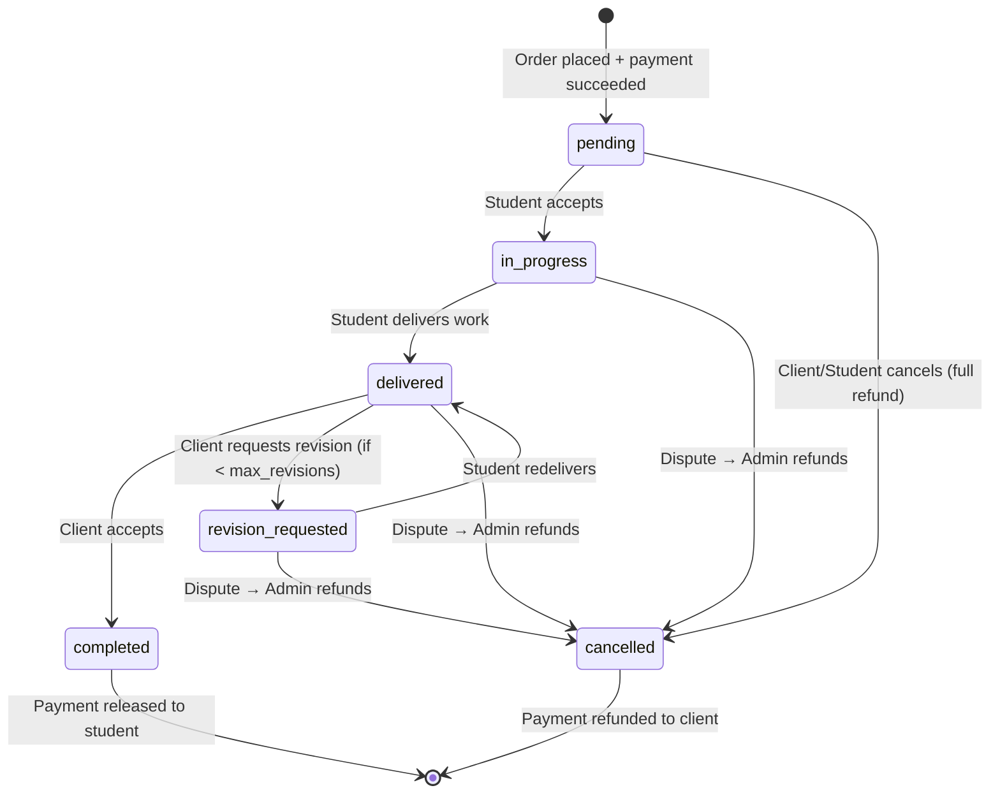
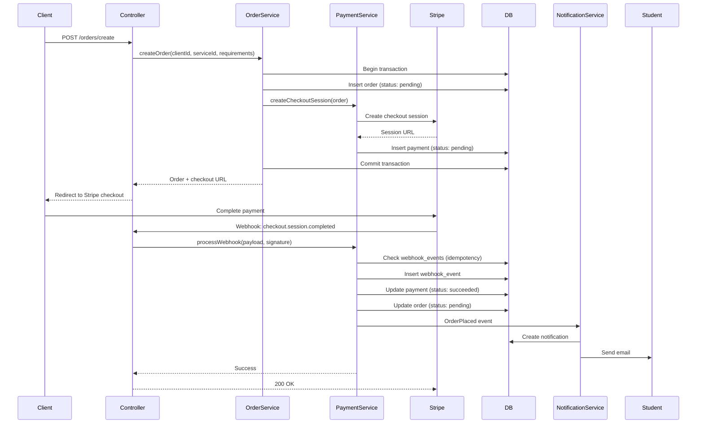
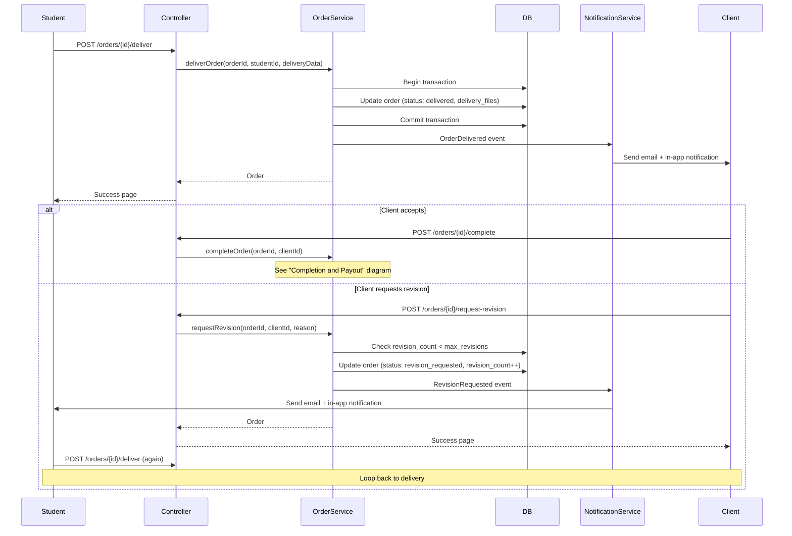
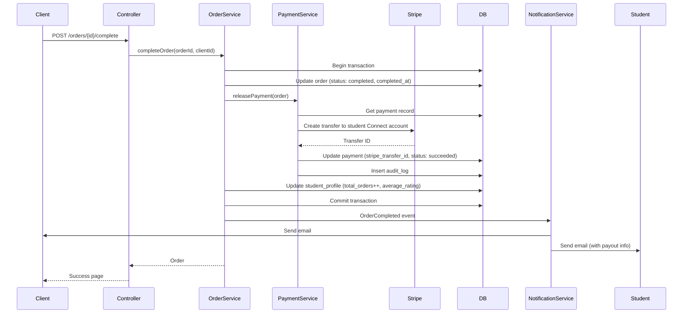
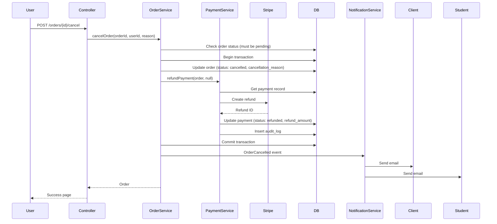
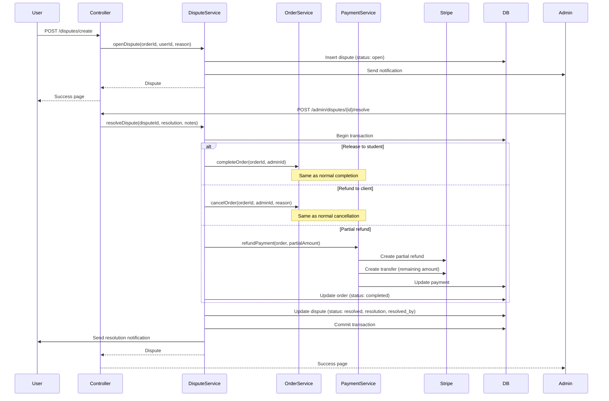
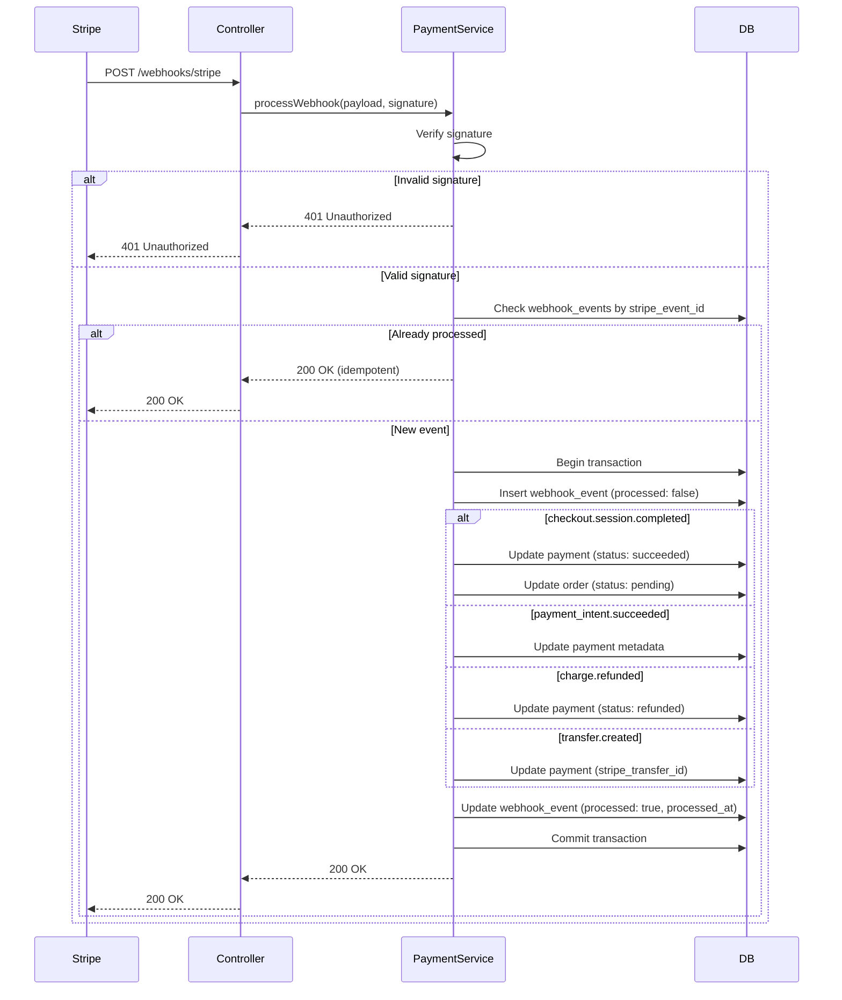
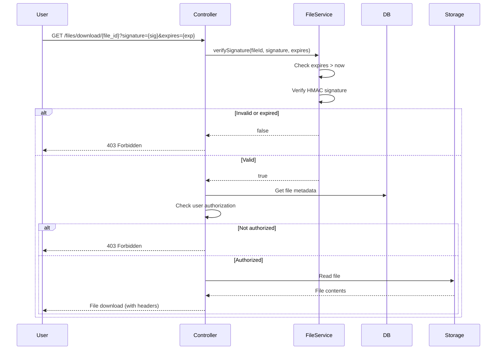

# Design Document

## Overview

The Student Skills Marketplace is a classic three-tier PHP application using server-side rendering. The architecture separates concerns into Presentation (UI templates), Application (business logic), and Data (persistence) layers. The system integrates Stripe for payments, PHPMailer for notifications, and uses MySQL for data storage.

### Key Design Principles

- Server-rendered HTML with progressive enhancement (Tailwind CSS + Alpine.js)
- Strict role-based access control on all operations
- Idempotent payment operations with audit trails
- Transactional state management for orders and payments
- Secure file handling with signed downloads
- Event-driven notifications and side effects

### Technology Stack

- **Backend**: PHP 8.1+
- **Database**: MySQL 8.0+
- **Payments**: Stripe API with stripe-php SDK, Stripe Connect for student payouts
- **Email**: PHPMailer with Gmail SMTP (App Password)
- **Frontend**: Tailwind CSS (CDN), Alpine.js for interactivity, vanilla JavaScript
- **File Storage**: Private filesystem with signed URL access
- **Testing**: PHPUnit for unit and feature tests

## Architecture

### Three-Tier Architecture

```
┌─────────────────────────────────────────────────────────────┐
│                    PRESENTATION LAYER                        │
│  ┌──────────────┐  ┌──────────────┐  ┌──────────────┐      │
│  │   Templates  │  │   Partials   │  │  Tailwind +  │      │
│  │   (Views)    │  │  (Components)│  │   Alpine.js  │      │
│  └──────────────┘  └──────────────┘  └──────────────┘      │
└─────────────────────────────────────────────────────────────┘
                            ↕
┌─────────────────────────────────────────────────────────────┐
│                   APPLICATION LAYER                          │
│  ┌──────────────┐  ┌──────────────┐  ┌──────────────┐      │
│  │  Controllers │  │   Services   │  │   Policies   │      │
│  │   (HTTP)     │  │  (Business)  │  │    (RBAC)    │      │
│  └──────────────┘  └──────────────┘  └──────────────┘      │
│  ┌──────────────┐  ┌──────────────┐  ┌──────────────┐      │
│  │  Validators  │  │    Events    │  │     Jobs     │      │
│  └──────────────┘  └──────────────┘  └──────────────┘      │
└─────────────────────────────────────────────────────────────┘
                            ↕
┌─────────────────────────────────────────────────────────────┐
│                      DATA LAYER                              │
│  ┌──────────────┐  ┌──────────────┐  ┌──────────────┐      │
│  │ Repositories │  │    Models    │  │    MySQL     │      │
│  │   (Data)     │  │   (Entities) │  │   Database   │      │
│  └──────────────┘  └──────────────┘  └──────────────┘      │
└─────────────────────────────────────────────────────────────┘
```

### Presentation Layer

**Responsibilities**: Render HTML, handle user input, display data

**Components**:

- **Templates**: Full-page PHP templates with layout inheritance
- **Partials**: Reusable UI components (cards, forms, modals)
- **Assets**: Tailwind CSS via CDN, Alpine.js for reactive components
- **Client-side JS**: Minimal vanilla JavaScript for file uploads, polling, form enhancements

**Patterns**:

- Template inheritance with base layout
- Component-based partials for reusability
- Progressive enhancement (works without JS, enhanced with JS)
- CSRF token embedding in all forms
- Context-aware output escaping

### Application Layer

**Responsibilities**: Business logic, orchestration, authorization, event handling

**Components**:

1. **Front Controller & Router**

   - Single entry point (index.php)
   - Route definitions mapping URLs to controllers
   - Middleware pipeline (authentication, CSRF, rate limiting)

2. **Controllers**

   - Thin HTTP handlers
   - Validate input, delegate to services
   - Return views or redirects
   - Examples: AuthController, ServiceController, OrderController, MessageController, ReviewController, AdminController

3. **Services**

   - Core business logic
   - Orchestrate repositories, external APIs
   - Enforce business rules
   - Examples: OrderService, PaymentService, MessageService, ReviewService, NotificationService

4. **Policies & Guards**

   - Authorization logic
   - Role-based access control
   - Resource ownership checks
   - Examples: OrderPolicy, ServicePolicy, MessagePolicy

5. **Validators**

   - Input validation rules
   - Sanitization
   - Error message generation
   - Examples: ServiceValidator, OrderValidator, ReviewValidator

6. **Events & Listeners**

   - Decouple side effects from core logic
   - Events: OrderPlaced, OrderDelivered, OrderCompleted, ReviewSubmitted, DisputeOpened
   - Listeners: SendNotification, UpdateStatistics, LogAudit

7. **Jobs**

   - Asynchronous tasks (can be synchronous for MVP)
   - Email sending
   - Webhook processing
   - Examples: SendEmailJob, ProcessStripeWebhookJob

8. **Logging**
   - Structured logging for errors, security events, audit trail
   - Log levels: DEBUG, INFO, WARNING, ERROR, CRITICAL
   - Separate logs for application, security, and audit

### Data Layer

**Responsibilities**: Data persistence, retrieval, query optimization

**Components**:

1. **Repositories**

   - Data access abstraction
   - CRUD operations with prepared statements
   - Query builders for complex queries
   - Examples: UserRepository, ServiceRepository, OrderRepository, MessageRepository, ReviewRepository

2. **Models (Entities)**

   - Domain objects representing database records
   - Validation methods
   - Relationship accessors
   - Examples: User, Service, Order, Message, Review, Payment

3. **Database**
   - MySQL with InnoDB engine
   - Transactions for consistency
   - Indexes for performance
   - Foreign key constraints

## Components and Interfaces

### Core Services

#### OrderService

```php
interface OrderService {
    public function createOrder(int $clientId, int $serviceId, array $requirements): Order;
    public function acceptOrder(int $orderId, int $studentId): Order;
    public function deliverOrder(int $orderId, int $studentId, array $deliveryData): Order;
    public function requestRevision(int $orderId, int $clientId, string $reason): Order;
    public function completeOrder(int $orderId, int $clientId): Order;
    public function cancelOrder(int $orderId, int $userId, string $reason): Order;
    public function getOrderById(int $orderId): ?Order;
    public function getOrdersForStudent(int $studentId, ?string $status): array;
    public function getOrdersForClient(int $clientId, ?string $status): array;
}
```

#### PaymentService

```php
interface PaymentService {
    public function createCheckoutSession(Order $order): string; // Returns Stripe session URL
    public function processWebhook(string $payload, string $signature): void;
    public function releasePayment(Order $order): void;
    public function refundPayment(Order $order, ?float $amount): void;
    public function getPaymentHistory(int $orderId): array;
}
```

#### MessageService

```php
interface MessageService {
    public function sendMessage(int $senderId, int $orderId, string $content, array $attachments): Message;
    public function getOrderMessages(int $orderId): array;
    public function markMessagesAsRead(int $orderId, int $userId): void;
    public function getUnreadCount(int $userId): int;
    public function moderateMessage(Message $message): bool; // Returns true if flagged
}
```

#### ReviewService

```php
interface ReviewService {
    public function createReview(int $orderId, int $clientId, int $rating, ?string $comment): Review;
    public function updateReview(int $reviewId, int $clientId, int $rating, ?string $comment): Review;
    public function addStudentReply(int $reviewId, int $studentId, string $reply): Review;
    public function getReviewsForStudent(int $studentId, int $page): array;
    public function calculateAverageRating(int $studentId): float;
}
```

#### NotificationService

```php
interface NotificationService {
    public function sendEmail(string $to, string $subject, string $template, array $data): void;
    public function createInAppNotification(int $userId, string $type, string $message, ?string $link): void;
    public function getNotifications(int $userId, bool $unreadOnly): array;
    public function markAsRead(int $notificationId, int $userId): void;
}
```

### Policies

#### OrderPolicy

```php
interface OrderPolicy {
    public function canView(User $user, Order $order): bool;
    public function canAccept(User $user, Order $order): bool;
    public function canDeliver(User $user, Order $order): bool;
    public function canRequestRevision(User $user, Order $order): bool;
    public function canComplete(User $user, Order $order): bool;
    public function canCancel(User $user, Order $order): bool;
}
```

## Data Models

### Database Schema

#### users

```sql
CREATE TABLE users (
    id INT UNSIGNED AUTO_INCREMENT PRIMARY KEY,
    email VARCHAR(255) UNIQUE NOT NULL,
    password_hash VARCHAR(255) NOT NULL,
    role ENUM('student', 'client', 'admin') NOT NULL,
    status ENUM('unverified', 'active', 'suspended') DEFAULT 'unverified',
    email_verified_at TIMESTAMP NULL,
    verification_token VARCHAR(64) NULL,
    reset_token VARCHAR(64) NULL,
    reset_token_expires_at TIMESTAMP NULL,
    created_at TIMESTAMP DEFAULT CURRENT_TIMESTAMP,
    updated_at TIMESTAMP DEFAULT CURRENT_TIMESTAMP ON UPDATE CURRENT_TIMESTAMP,
    INDEX idx_email (email),
    INDEX idx_role_status (role, status)
) ENGINE=InnoDB;
```

#### student_profiles

```sql
CREATE TABLE student_profiles (
    id INT UNSIGNED AUTO_INCREMENT PRIMARY KEY,
    user_id INT UNSIGNED UNIQUE NOT NULL,
    bio TEXT,
    skills JSON, -- Array of skill tags
    portfolio_files JSON, -- Array of file paths
    average_rating DECIMAL(3,2) DEFAULT 0.00,
    total_reviews INT UNSIGNED DEFAULT 0,
    total_orders INT UNSIGNED DEFAULT 0,
    stripe_connect_account_id VARCHAR(255) NULL,
    stripe_onboarding_complete BOOLEAN DEFAULT FALSE,
    created_at TIMESTAMP DEFAULT CURRENT_TIMESTAMP,
    updated_at TIMESTAMP DEFAULT CURRENT_TIMESTAMP ON UPDATE CURRENT_TIMESTAMP,
    FOREIGN KEY (user_id) REFERENCES users(id) ON DELETE CASCADE,
    INDEX idx_average_rating (average_rating)
) ENGINE=InnoDB;
```

#### categories

```sql
CREATE TABLE categories (
    id INT UNSIGNED AUTO_INCREMENT PRIMARY KEY,
    name VARCHAR(100) UNIQUE NOT NULL,
    slug VARCHAR(100) UNIQUE NOT NULL,
    description TEXT,
    created_at TIMESTAMP DEFAULT CURRENT_TIMESTAMP,
    INDEX idx_slug (slug)
) ENGINE=InnoDB;
```

#### services

```sql
CREATE TABLE services (
    id INT UNSIGNED AUTO_INCREMENT PRIMARY KEY,
    student_id INT UNSIGNED NOT NULL,
    category_id INT UNSIGNED NOT NULL,
    title VARCHAR(255) NOT NULL,
    description TEXT NOT NULL,
    tags JSON, -- Array of tags
    price DECIMAL(10,2) NOT NULL,
    delivery_days INT UNSIGNED NOT NULL,
    sample_files JSON, -- Array of file paths
    status ENUM('inactive', 'active', 'paused') DEFAULT 'inactive',
    created_at TIMESTAMP DEFAULT CURRENT_TIMESTAMP,
    updated_at TIMESTAMP DEFAULT CURRENT_TIMESTAMP ON UPDATE CURRENT_TIMESTAMP,
    FOREIGN KEY (student_id) REFERENCES users(id) ON DELETE CASCADE,
    FOREIGN KEY (category_id) REFERENCES categories(id),
    INDEX idx_student_status (student_id, status),
    INDEX idx_category_status (category_id, status),
    INDEX idx_price (price),
    FULLTEXT idx_search (title, description)
) ENGINE=InnoDB;
```

#### orders

```sql
CREATE TABLE orders (
    id INT UNSIGNED AUTO_INCREMENT PRIMARY KEY,
    client_id INT UNSIGNED NOT NULL,
    student_id INT UNSIGNED NOT NULL,
    service_id INT UNSIGNED NOT NULL,
    status ENUM('pending', 'in_progress', 'delivered', 'revision_requested', 'completed', 'cancelled') NOT NULL,
    requirements TEXT NOT NULL,
    requirement_files JSON, -- Array of file paths
    delivery_message TEXT NULL,
    delivery_files JSON NULL,
    price DECIMAL(10,2) NOT NULL,
    commission_rate DECIMAL(5,2) NOT NULL, -- Percentage at time of order
    deadline TIMESTAMP NOT NULL,
    revision_count INT UNSIGNED DEFAULT 0,
    max_revisions INT UNSIGNED DEFAULT 3,
    completed_at TIMESTAMP NULL,
    cancelled_at TIMESTAMP NULL,
    cancellation_reason TEXT NULL,
    created_at TIMESTAMP DEFAULT CURRENT_TIMESTAMP,
    updated_at TIMESTAMP DEFAULT CURRENT_TIMESTAMP ON UPDATE CURRENT_TIMESTAMP,
    FOREIGN KEY (client_id) REFERENCES users(id),
    FOREIGN KEY (student_id) REFERENCES users(id),
    FOREIGN KEY (service_id) REFERENCES services(id),
    INDEX idx_client_status (client_id, status),
    INDEX idx_student_status (student_id, status),
    INDEX idx_status_deadline (status, deadline),
    INDEX idx_created_at (created_at)
) ENGINE=InnoDB;
```

#### payments

```sql
CREATE TABLE payments (
    id INT UNSIGNED AUTO_INCREMENT PRIMARY KEY,
    order_id INT UNSIGNED NOT NULL,
    stripe_payment_intent_id VARCHAR(255) UNIQUE NOT NULL,
    stripe_checkout_session_id VARCHAR(255) NULL,
    stripe_transfer_id VARCHAR(255) NULL,
    amount DECIMAL(10,2) NOT NULL,
    commission_amount DECIMAL(10,2) NOT NULL,
    student_amount DECIMAL(10,2) NOT NULL,
    status ENUM('pending', 'succeeded', 'refunded', 'partially_refunded', 'failed') NOT NULL,
    refund_amount DECIMAL(10,2) DEFAULT 0.00,
    metadata JSON, -- Additional Stripe metadata
    created_at TIMESTAMP DEFAULT CURRENT_TIMESTAMP,
    updated_at TIMESTAMP DEFAULT CURRENT_TIMESTAMP ON UPDATE CURRENT_TIMESTAMP,
    FOREIGN KEY (order_id) REFERENCES orders(id),
    INDEX idx_order_id (order_id),
    INDEX idx_stripe_payment_intent (stripe_payment_intent_id)
) ENGINE=InnoDB;
```

#### messages

```sql
CREATE TABLE messages (
    id INT UNSIGNED AUTO_INCREMENT PRIMARY KEY,
    order_id INT UNSIGNED NOT NULL,
    sender_id INT UNSIGNED NOT NULL,
    content TEXT NOT NULL,
    attachments JSON, -- Array of file paths
    is_flagged BOOLEAN DEFAULT FALSE,
    read_by_client BOOLEAN DEFAULT FALSE,
    read_by_student BOOLEAN DEFAULT FALSE,
    created_at TIMESTAMP DEFAULT CURRENT_TIMESTAMP,
    FOREIGN KEY (order_id) REFERENCES orders(id) ON DELETE CASCADE,
    FOREIGN KEY (sender_id) REFERENCES users(id),
    INDEX idx_order_created (order_id, created_at),
    INDEX idx_flagged (is_flagged)
) ENGINE=InnoDB;
```

#### reviews

```sql
CREATE TABLE reviews (
    id INT UNSIGNED AUTO_INCREMENT PRIMARY KEY,
    order_id INT UNSIGNED UNIQUE NOT NULL,
    client_id INT UNSIGNED NOT NULL,
    student_id INT UNSIGNED NOT NULL,
    rating TINYINT UNSIGNED NOT NULL CHECK (rating BETWEEN 1 AND 5),
    comment TEXT NULL,
    student_reply TEXT NULL,
    student_replied_at TIMESTAMP NULL,
    can_edit_until TIMESTAMP NOT NULL, -- 24 hours from creation
    created_at TIMESTAMP DEFAULT CURRENT_TIMESTAMP,
    updated_at TIMESTAMP DEFAULT CURRENT_TIMESTAMP ON UPDATE CURRENT_TIMESTAMP,
    FOREIGN KEY (order_id) REFERENCES orders(id),
    FOREIGN KEY (client_id) REFERENCES users(id),
    FOREIGN KEY (student_id) REFERENCES users(id),
    INDEX idx_student_created (student_id, created_at),
    INDEX idx_rating (rating)
) ENGINE=InnoDB;
```

#### disputes

```sql
CREATE TABLE disputes (
    id INT UNSIGNED AUTO_INCREMENT PRIMARY KEY,
    order_id INT UNSIGNED UNIQUE NOT NULL,
    opened_by INT UNSIGNED NOT NULL,
    reason TEXT NOT NULL,
    status ENUM('open', 'resolved') DEFAULT 'open',
    resolution ENUM('release_to_student', 'refund_to_client', 'partial_refund') NULL,
    resolution_notes TEXT NULL,
    resolved_by INT UNSIGNED NULL,
    resolved_at TIMESTAMP NULL,
    created_at TIMESTAMP DEFAULT CURRENT_TIMESTAMP,
    FOREIGN KEY (order_id) REFERENCES orders(id),
    FOREIGN KEY (opened_by) REFERENCES users(id),
    FOREIGN KEY (resolved_by) REFERENCES users(id),
    INDEX idx_status (status)
) ENGINE=InnoDB;
```

#### notifications

```sql
CREATE TABLE notifications (
    id INT UNSIGNED AUTO_INCREMENT PRIMARY KEY,
    user_id INT UNSIGNED NOT NULL,
    type VARCHAR(50) NOT NULL,
    title VARCHAR(255) NOT NULL,
    message TEXT NOT NULL,
    link VARCHAR(255) NULL,
    is_read BOOLEAN DEFAULT FALSE,
    created_at TIMESTAMP DEFAULT CURRENT_TIMESTAMP,
    FOREIGN KEY (user_id) REFERENCES users(id) ON DELETE CASCADE,
    INDEX idx_user_read_created (user_id, is_read, created_at)
) ENGINE=InnoDB;
```

#### audit_logs

```sql
CREATE TABLE audit_logs (
    id INT UNSIGNED AUTO_INCREMENT PRIMARY KEY,
    user_id INT UNSIGNED NULL,
    action VARCHAR(100) NOT NULL,
    resource_type VARCHAR(50) NOT NULL,
    resource_id INT UNSIGNED NULL,
    old_values JSON NULL,
    new_values JSON NULL,
    ip_address VARCHAR(45) NULL,
    user_agent TEXT NULL,
    created_at TIMESTAMP DEFAULT CURRENT_TIMESTAMP,
    FOREIGN KEY (user_id) REFERENCES users(id) ON DELETE SET NULL,
    INDEX idx_user_created (user_id, created_at),
    INDEX idx_resource (resource_type, resource_id),
    INDEX idx_action (action)
) ENGINE=InnoDB;
```

#### webhook_events

```sql
CREATE TABLE webhook_events (
    id INT UNSIGNED AUTO_INCREMENT PRIMARY KEY,
    stripe_event_id VARCHAR(255) UNIQUE NOT NULL,
    event_type VARCHAR(100) NOT NULL,
    payload JSON NOT NULL,
    processed BOOLEAN DEFAULT FALSE,
    processed_at TIMESTAMP NULL,
    error TEXT NULL,
    created_at TIMESTAMP DEFAULT CURRENT_TIMESTAMP,
    INDEX idx_stripe_event_id (stripe_event_id),
    INDEX idx_processed (processed)
) ENGINE=InnoDB;
```

#### platform_settings

```sql
CREATE TABLE platform_settings (
    id INT UNSIGNED AUTO_INCREMENT PRIMARY KEY,
    setting_key VARCHAR(100) UNIQUE NOT NULL,
    setting_value TEXT NOT NULL,
    updated_by INT UNSIGNED NULL,
    updated_at TIMESTAMP DEFAULT CURRENT_TIMESTAMP ON UPDATE CURRENT_TIMESTAMP,
    FOREIGN KEY (updated_by) REFERENCES users(id) ON DELETE SET NULL,
    INDEX idx_key (setting_key)
) ENGINE=InnoDB;
```

## Order State Machine

### State Diagram



### State Transition Rules

| From State         | To State           | Trigger                  | Guard Conditions               | Side Effects                                    |
| ------------------ | ------------------ | ------------------------ | ------------------------------ | ----------------------------------------------- |
| -                  | pending            | Order placed             | Payment succeeded              | Create order, send notification                 |
| pending            | in_progress        | Student accepts          | Student owns service           | Update deadline, notify client                  |
| pending            | cancelled          | Client/Student cancels   | No work started                | Full refund, notify both                        |
| in_progress        | delivered          | Student delivers         | Has delivery files             | Notify client, start acceptance timer           |
| in_progress        | cancelled          | Admin resolves dispute   | Dispute opened                 | Refund, notify both                             |
| delivered          | completed          | Client accepts           | Client owns order              | Release payment, deduct commission, notify both |
| delivered          | revision_requested | Client requests revision | revision_count < max_revisions | Increment revision_count, notify student        |
| delivered          | cancelled          | Admin resolves dispute   | Dispute opened                 | Refund, notify both                             |
| revision_requested | delivered          | Student redelivers       | Has new delivery files         | Notify client                                   |
| revision_requested | cancelled          | Admin resolves dispute   | Dispute opened                 | Refund, notify both                             |

### Failure Handling

- **Payment failure during order placement**: Order not created, user shown error
- **Webhook delivery failure**: Stripe retries with exponential backoff; idempotency prevents duplicate processing
- **State transition failure**: Transaction rolled back, error logged, user shown generic error
- **Refund failure**: Logged for manual admin review, order remains in current state
- **Transfer failure**: Logged for manual admin review, order marked completed but payment pending

## Sequence Diagrams

### Order Placement with Escrow Funding



### Delivery and Revision Loop



### Completion and Payout



### Cancellation and Refund



### Dispute Resolution Flow



### Webhook Reconciliation



## File Storage and Access Control

### Storage Layout

```
/storage/
  /uploads/
    /profiles/
      /{user_id}/
        /{random_filename}.{ext}
    /services/
      /{service_id}/
        /{random_filename}.{ext}
    /orders/
      /{order_id}/
        /requirements/
          /{random_filename}.{ext}
        /delivery/
          /{random_filename}.{ext}
    /messages/
      /{order_id}/
        /{random_filename}.{ext}
```

### File Upload Process

1. **Validation**:

   - Check file extension against allowlist (jpg, jpeg, png, gif, pdf, doc, docx, zip)
   - Verify MIME type matches extension
   - Check file size against limits (10MB for images, 25MB for documents)
   - For images, verify valid image data by reading dimensions

2. **Storage**:

   - Generate random filename: `{uuid}.{original_extension}`
   - Store outside web root in appropriate directory
   - Save file metadata to database (original_name, size, mime_type, path)

3. **Access Control**:
   - No direct web server access to /storage/
   - All downloads through controller route: `/files/download/{file_id}`
   - Controller checks authorization before serving file

### Signed Download Flow



### Authorization Rules

- **Profile portfolio files**: Public (anyone can view)
- **Service sample files**: Public (anyone can view)
- **Order requirement files**: Client and Student of order only
- **Order delivery files**: Client and Student of order only
- **Message attachments**: Client and Student of order only
- **Admin**: Can access all files

## Security Design

### Authentication

**Password Hashing**:

- Algorithm: bcrypt with cost factor 12
- PHP function: `password_hash($password, PASSWORD_BCRYPT, ['cost' => 12])`
- Verification: `password_verify($password, $hash)`

**Session Management**:

- PHP sessions with secure settings:
  - `session.cookie_httponly = 1`
  - `session.cookie_secure = 1` (HTTPS only)
  - `session.cookie_samesite = 'Strict'`
  - `session.use_strict_mode = 1`
- Session regeneration after login
- Session timeout: 2 hours of inactivity

**Email Verification**:

- Token: 32-byte random hex string
- Expiration: 24 hours
- One-time use (deleted after verification)

**Password Reset**:

- Token: 32-byte random hex string
- Expiration: 1 hour
- One-time use (deleted after reset)

### Authorization (RBAC)

**Role Hierarchy**:

- Admin > Student/Client
- No role inheritance (explicit checks)

**Policy Pattern**:

```php
class OrderPolicy {
    public function canView(User $user, Order $order): bool {
        return $user->isAdmin()
            || $user->id === $order->client_id
            || $user->id === $order->student_id;
    }

    public function canDeliver(User $user, Order $order): bool {
        return $user->id === $order->student_id
            && in_array($order->status, ['in_progress', 'revision_requested']);
    }
}
```

**Enforcement**:

- Every controller action checks policy before execution
- Middleware for role-based route protection
- Database queries filtered by user ownership

### CSRF Protection

**Token Generation**:

- Generate per-session token: 32-byte random hex
- Store in session: `$_SESSION['csrf_token']`
- Embed in forms: `<input type="hidden" name="csrf_token" value="<?= $_SESSION['csrf_token'] ?>">`

**Token Validation**:

- Check on all POST/PUT/PATCH/DELETE requests
- Compare submitted token with session token using `hash_equals()`
- Reject if missing or mismatched

**Token Rotation**:

- Regenerate after login/logout
- Keep same token during session for simplicity

### XSS Prevention

**Output Escaping**:

- HTML context: `htmlspecialchars($data, ENT_QUOTES, 'UTF-8')`
- JavaScript context: `json_encode($data, JSON_HEX_TAG | JSON_HEX_AMP)`
- URL context: `urlencode($data)`
- CSS context: Avoid user input in CSS; if needed, strict allowlist

**Template Helper**:

```php
function e($data) {
    return htmlspecialchars($data, ENT_QUOTES, 'UTF-8');
}
```

**Rich Text Sanitization**:

- Use HTML Purifier library
- Allowlist: `<p>, <br>, <strong>, <em>, <ul>, <ol>, <li>, <a>`
- Strip all attributes except `href` on `<a>` (with URL validation)

### SQL Injection Prevention

**Prepared Statements**:

```php
$stmt = $pdo->prepare('SELECT * FROM users WHERE email = ? AND status = ?');
$stmt->execute([$email, 'active']);
```

**Query Builder**:

- Use parameterized queries for all dynamic values
- Never concatenate user input into SQL strings
- Validate/sanitize table and column names if dynamic (use allowlist)

### File Upload Security

**Validation**:

1. Extension allowlist: `['jpg', 'jpeg', 'png', 'gif', 'pdf', 'doc', 'docx', 'zip']`
2. MIME type check: `mime_content_type($file['tmp_name'])`
3. MIME/extension match verification
4. Size limits: 10MB for images, 25MB for documents
5. Image verification: `getimagesize($file['tmp_name'])` for image files

**Storage**:

- Store outside web root: `/storage/uploads/`
- Randomized filenames: `{uuid}.{ext}`
- No execution permissions on upload directory
- Serve through PHP controller with authorization

**Download Headers**:

```php
header('Content-Type: application/octet-stream');
header('Content-Disposition: attachment; filename="' . $safe_filename . '"');
header('Content-Length: ' . filesize($path));
header('X-Content-Type-Options: nosniff');
```

### Rate Limiting

**Implementation**:

- Store attempt counts in database or cache (Redis/Memcached)
- Key format: `rate_limit:{action}:{identifier}:{window}`
- Example: `rate_limit:login:user@example.com:20241110_14` (hourly window)

**Limits**:

- Login attempts: 5 per email per 15 minutes
- Password reset: 10 per email per hour
- Search requests: 100 per user per minute
- Webhook endpoint: 1000 per minute globally
- API endpoints: 60 per user per minute

**Response**:

- HTTP 429 Too Many Requests
- `Retry-After` header with seconds until reset
- Clear error message

### Webhook Security

**Signature Verification**:

```php
$signature = $_SERVER['HTTP_STRIPE_SIGNATURE'];
$payload = file_get_contents('php://input');

try {
    $event = \Stripe\Webhook::constructEvent(
        $payload,
        $signature,
        $webhookSecret
    );
} catch (\Stripe\Exception\SignatureVerificationException $e) {
    http_response_code(401);
    exit;
}
```

**Idempotency**:

- Check `stripe_event_id` in `webhook_events` table
- If exists, return 200 without processing
- If new, process and insert record

### Audit Logging

**Events to Log**:

- Authentication: login, logout, failed login, password reset
- Authorization: access denied (403)
- Orders: state changes, cancellations
- Payments: charges, refunds, transfers
- Admin actions: user suspension, dispute resolution, settings changes
- Security: rate limit exceeded, invalid CSRF token, file upload rejection

**Log Format**:

```php
[
    'user_id' => $userId,
    'action' => 'order.completed',
    'resource_type' => 'order',
    'resource_id' => $orderId,
    'old_values' => ['status' => 'delivered'],
    'new_values' => ['status' => 'completed'],
    'ip_address' => $_SERVER['REMOTE_ADDR'],
    'user_agent' => $_SERVER['HTTP_USER_AGENT'],
    'created_at' => date('Y-m-d H:i:s')
]
```

**Retention**:

- Minimum 90 days
- Archive older logs to cold storage
- Admin access only

## Error Handling Strategy

### Error Categories

1. **User Errors** (4xx):

   - Validation failures
   - Authorization failures
   - Not found errors
   - Rate limit exceeded

2. **System Errors** (5xx):
   - Database connection failures
   - External API failures (Stripe, email)
   - File system errors
   - Unexpected exceptions

### Error Response Format

**HTML (Server-Rendered)**:

- Display user-friendly error page with message
- Include navigation back to safe page
- Log technical details server-side
- Never expose stack traces or sensitive info to users

**JSON (AJAX Requests)**:

```json
{
  "success": false,
  "error": {
    "code": "VALIDATION_ERROR",
    "message": "The provided data is invalid",
    "fields": {
      "email": ["Email is required"],
      "password": ["Password must be at least 8 characters"]
    }
  }
}
```

### Exception Handling

**Global Exception Handler**:

```php
set_exception_handler(function($exception) {
    // Log exception with stack trace
    error_log($exception->getMessage() . "\n" . $exception->getTraceAsString());

    // Show generic error to user
    http_response_code(500);
    include 'views/errors/500.php';
});
```

**Custom Exceptions**:

- `ValidationException`: User input validation failed
- `AuthorizationException`: User lacks permission
- `NotFoundException`: Resource not found
- `PaymentException`: Payment processing failed
- `RateLimitException`: Rate limit exceeded

### Logging Strategy

**Log Levels**:

- **DEBUG**: Detailed diagnostic info (development only)
- **INFO**: General informational messages (order placed, user registered)
- **WARNING**: Unexpected but handled situations (payment retry, webhook duplicate)
- **ERROR**: Errors that need attention (payment failed, email send failed)
- **CRITICAL**: System-level failures (database down, Stripe API unreachable)

**Log Files**:

- `/logs/app.log`: General application logs
- `/logs/security.log`: Authentication, authorization, rate limiting
- `/logs/audit.log`: User actions, state changes
- `/logs/payment.log`: Payment operations, webhook processing
- `/logs/error.log`: Exceptions and errors

**Log Format**:

```
[2024-11-10 14:23:45] [ERROR] [OrderService] Payment failed for order #123: Insufficient funds
Context: {"order_id": 123, "client_id": 45, "amount": 150.00, "stripe_error": "card_declined"}
```

### Idempotency

**Payment Operations**:

- Use Stripe idempotency keys for charge/refund/transfer operations
- Key format: `{operation}_{order_id}_{timestamp}`
- Store keys in payment records for audit

**Webhook Processing**:

- Check `stripe_event_id` before processing
- Use database transaction to ensure atomic insert + process
- Return 200 even if already processed (idempotent)

**State Transitions**:

- Check current state before transition
- Use database transactions for atomic updates
- Validate transition is allowed by state machine

### Retry Logic

**External API Calls**:

- Stripe API: 3 retries with exponential backoff (1s, 2s, 4s)
- Email sending: 2 retries with 5s delay
- Webhook delivery (Stripe handles): Automatic retry by Stripe

**Database Operations**:

- Deadlock detection: Retry transaction up to 3 times
- Connection failures: Reconnect and retry once

**Failure Handling**:

- Log all retry attempts
- After max retries, log error and alert admin
- For critical operations (payments), create manual review task

## Testing Strategy

### Test Pyramid

```
        /\
       /  \
      / E2E \         End-to-End (Minimal)
     /______\
    /        \
   / Feature  \       Feature/Integration Tests
  /____________\
 /              \
/  Unit Tests    \    Unit Tests (Majority)
/__________________\
```

### Unit Tests

**Target**: Individual classes and methods in isolation

**Coverage**:

- Services: Business logic, validation, calculations
- Policies: Authorization rules
- Validators: Input validation rules
- Models: Entity methods, relationships
- Utilities: Helper functions

**Example**:

```php
class OrderServiceTest extends TestCase {
    public function testCreateOrderWithValidData() {
        $service = new OrderService($mockRepo, $mockPayment);
        $order = $service->createOrder(1, 2, ['requirements' => 'Test']);

        $this->assertEquals('pending', $order->status);
        $this->assertNotNull($order->deadline);
    }

    public function testCannotDeliverOrderInWrongState() {
        $this->expectException(ValidationException::class);
        $service->deliverOrder($pendingOrder, 1, []);
    }
}
```

### Feature Tests

**Target**: Complete user workflows with database

**Coverage**:

- Order lifecycle: placement → acceptance → delivery → completion
- Payment flows: charge → hold → release/refund
- Messaging: send → receive → mark read
- Reviews: submit → calculate average → student reply
- Admin actions: dispute resolution, user suspension

**Example**:

```php
class OrderFlowTest extends TestCase {
    use DatabaseTransactions;

    public function testCompleteOrderFlow() {
        // Setup
        $client = $this->createUser('client');
        $student = $this->createUser('student');
        $service = $this->createService($student);

        // Place order
        $order = $this->actingAs($client)->post('/orders/create', [
            'service_id' => $service->id,
            'requirements' => 'Build a website'
        ]);
        $this->assertEquals('pending', $order->status);

        // Accept order
        $this->actingAs($student)->post("/orders/{$order->id}/accept");
        $order->refresh();
        $this->assertEquals('in_progress', $order->status);

        // Deliver order
        $this->actingAs($student)->post("/orders/{$order->id}/deliver", [
            'message' => 'Here is your website',
            'files' => [$this->createTestFile()]
        ]);
        $order->refresh();
        $this->assertEquals('delivered', $order->status);

        // Complete order
        $this->actingAs($client)->post("/orders/{$order->id}/complete");
        $order->refresh();
        $this->assertEquals('completed', $order->status);

        // Verify payment released
        $payment = $order->payment;
        $this->assertEquals('succeeded', $payment->status);
        $this->assertNotNull($payment->stripe_transfer_id);
    }
}
```

### Webhook Tests

**Target**: Webhook processing with fixtures

**Coverage**:

- Signature verification
- Idempotency (duplicate events)
- Event type handling
- Error scenarios

**Example**:

```php
class StripeWebhookTest extends TestCase {
    public function testCheckoutSessionCompletedWebhook() {
        $order = $this->createOrder();
        $payload = $this->getWebhookFixture('checkout.session.completed', [
            'metadata' => ['order_id' => $order->id]
        ]);
        $signature = $this->generateWebhookSignature($payload);

        $response = $this->post('/webhooks/stripe', $payload, [
            'HTTP_STRIPE_SIGNATURE' => $signature
        ]);

        $response->assertStatus(200);
        $order->refresh();
        $this->assertEquals('pending', $order->status);
    }

    public function testDuplicateWebhookIsIdempotent() {
        $payload = $this->getWebhookFixture('checkout.session.completed');
        $signature = $this->generateWebhookSignature($payload);

        // First request
        $this->post('/webhooks/stripe', $payload, [
            'HTTP_STRIPE_SIGNATURE' => $signature
        ])->assertStatus(200);

        // Duplicate request
        $this->post('/webhooks/stripe', $payload, [
            'HTTP_STRIPE_SIGNATURE' => $signature
        ])->assertStatus(200);

        // Verify processed only once
        $this->assertCount(1, WebhookEvent::where('stripe_event_id', $payload['id'])->get());
    }
}
```

### Policy Tests

**Target**: Authorization rules

**Coverage**:

- Role-based access
- Resource ownership
- State-based permissions

**Example**:

```php
class OrderPolicyTest extends TestCase {
    public function testClientCanViewTheirOrder() {
        $client = $this->createUser('client');
        $order = $this->createOrder(['client_id' => $client->id]);
        $policy = new OrderPolicy();

        $this->assertTrue($policy->canView($client, $order));
    }

    public function testClientCannotViewOthersOrder() {
        $client = $this->createUser('client');
        $otherOrder = $this->createOrder(['client_id' => 999]);
        $policy = new OrderPolicy();

        $this->assertFalse($policy->canView($client, $otherOrder));
    }

    public function testStudentCanDeliverInProgressOrder() {
        $student = $this->createUser('student');
        $order = $this->createOrder([
            'student_id' => $student->id,
            'status' => 'in_progress'
        ]);
        $policy = new OrderPolicy();

        $this->assertTrue($policy->canDeliver($student, $order));
    }
}
```

### Security Tests

**Target**: Security controls

**Coverage**:

- CSRF protection
- XSS prevention (output escaping)
- SQL injection prevention
- File upload validation
- Rate limiting

**Example**:

```php
class SecurityTest extends TestCase {
    public function testCSRFProtectionRejectsInvalidToken() {
        $user = $this->createUser();

        $response = $this->actingAs($user)->post('/orders/create', [
            'csrf_token' => 'invalid_token',
            'service_id' => 1
        ]);

        $response->assertStatus(403);
    }

    public function testFileUploadRejectsExecutableFiles() {
        $user = $this->createUser();
        $file = $this->createTestFile('malicious.php', 'text/php');

        $response = $this->actingAs($user)->post('/profile/upload', [
            'file' => $file
        ]);

        $response->assertStatus(422);
        $response->assertJson(['error' => 'File type not allowed']);
    }
}
```

### Test Data Management

**Factories**:

- User factory with roles
- Service factory with categories
- Order factory with various states
- Payment factory with Stripe IDs

**Seeders**:

- Categories and tags
- Test users (client, student, admin)
- Sample services
- Platform settings

**Database Transactions**:

- Wrap each test in transaction
- Rollback after test completion
- Ensures clean state for each test

## Frontend Design

### Template Structure

**Layout Hierarchy**:

```
layouts/
  base.php              # Master layout with <html>, <head>, <body>
  auth.php              # Extends base, adds auth-specific styling
  dashboard.php         # Extends base, adds navigation, sidebar
  admin.php             # Extends base, adds admin navigation

pages/
  home.php              # Landing page
  auth/
    login.php
    register.php
    verify-email.php
    reset-password.php
  student/
    dashboard.php
    services/
      index.php
      create.php
      edit.php
    orders/
      index.php
      show.php
    profile.php
  client/
    dashboard.php
    services/
      index.php
      show.php
    orders/
      index.php
      show.php
  orders/
    show.php            # Shared order detail view
  messages/
    index.php
  admin/
    dashboard.php
    users/
      index.php
      show.php
    services/
      index.php
    disputes/
      index.php
      show.php
    settings.php

partials/
  navigation.php
  sidebar.php
  service-card.php
  order-card.php
  message-thread.php
  review-item.php
  notification-item.php
  pagination.php
  alert.php
  modal.php
```

### Tailwind CSS Patterns

**Color Scheme**:

- Primary: Blue (trust, professionalism)
- Success: Green (completed, positive)
- Warning: Yellow (pending, attention)
- Danger: Red (cancelled, errors)
- Neutral: Gray (text, borders)

**Component Examples**:

**Service Card**:

```html
<div class="bg-white rounded-lg shadow-md p-6 hover:shadow-lg transition">
  <div class="flex items-start justify-between mb-4">
    <h3 class="text-xl font-semibold text-gray-900">
      <?= e($service->title) ?>
    </h3>
    <span class="px-3 py-1 bg-blue-100 text-blue-800 rounded-full text-sm">
      <?= e($service->category->name) ?>
    </span>
  </div>
  <p class="text-gray-600 mb-4 line-clamp-3"><?= e($service->description) ?></p>
  <div class="flex items-center justify-between">
    <div class="flex items-center space-x-2">
      <span class="text-yellow-500">★</span>
      <span class="font-medium"
        ><?= number_format($service->student->average_rating, 1) ?></span
      >
      <span class="text-gray-500"
        >(<?= $service->student->total_reviews ?>)</span
      >
    </div>
    <div class="text-right">
      <div class="text-2xl font-bold text-gray-900">
        $<?= number_format($service->price, 2) ?>
      </div>
      <div class="text-sm text-gray-500">
        <?= $service->delivery_days ?> days delivery
      </div>
    </div>
  </div>
</div>
```

**Order Status Badge**:

```html
<?php
$statusColors = [
    'pending' =>
'bg-yellow-100 text-yellow-800', 'in_progress' => 'bg-blue-100 text-blue-800',
'delivered' => 'bg-purple-100 text-purple-800', 'revision_requested' =>
'bg-orange-100 text-orange-800', 'completed' => 'bg-green-100 text-green-800',
'cancelled' => 'bg-red-100 text-red-800' ]; ?>
<span
  class="px-3 py-1 rounded-full text-sm font-medium <?= $statusColors[$order->status] ?>"
>
  <?= ucfirst(str_replace('_', ' ', $order->status)) ?>
</span>
```

### Alpine.js Patterns

**Dropdown Menu**:

```html
<div x-data="{ open: false }" class="relative">
  <button @click="open = !open" class="flex items-center space-x-2">
    <span>Menu</span>
    <svg class="w-4 h-4" fill="currentColor" viewBox="0 0 20 20">
      <path
        d="M5.293 7.293a1 1 0 011.414 0L10 10.586l3.293-3.293a1 1 0 111.414 1.414l-4 4a1 1 0 01-1.414 0l-4-4a1 1 0 010-1.414z"
      />
    </svg>
  </button>
  <div
    x-show="open"
    @click.away="open = false"
    class="absolute right-0 mt-2 w-48 bg-white rounded-md shadow-lg"
  >
    <a href="/profile" class="block px-4 py-2 hover:bg-gray-100">Profile</a>
    <a href="/logout" class="block px-4 py-2 hover:bg-gray-100">Logout</a>
  </div>
</div>
```

**Modal**:

```html
<div x-data="{ open: false }">
  <button @click="open = true" class="btn btn-primary">Open Modal</button>

  <div
    x-show="open"
    class="fixed inset-0 z-50 overflow-y-auto"
    style="display: none;"
  >
    <div class="flex items-center justify-center min-h-screen px-4">
      <div
        @click="open = false"
        class="fixed inset-0 bg-black opacity-50"
      ></div>
      <div class="relative bg-white rounded-lg max-w-md w-full p-6">
        <h3 class="text-lg font-semibold mb-4">Modal Title</h3>
        <p class="text-gray-600 mb-4">Modal content goes here.</p>
        <div class="flex justify-end space-x-2">
          <button @click="open = false" class="btn btn-secondary">
            Cancel
          </button>
          <button class="btn btn-primary">Confirm</button>
        </div>
      </div>
    </div>
  </div>
</div>
```

**File Upload Preview**:

```html
<div x-data="{ files: [], previews: [] }">
  <input
    type="file"
    multiple
    @change="
        files = Array.from($event.target.files);
        previews = files.map(f => URL.createObjectURL(f));
    "
    class="hidden"
    id="file-upload"
  />

  <label for="file-upload" class="btn btn-secondary cursor-pointer">
    Choose Files
  </label>

  <div class="mt-4 grid grid-cols-3 gap-4">
    <template x-for="(preview, index) in previews" :key="index">
      <div class="relative">
        
        <button
          @click="
                    files.splice(index, 1);
                    previews.splice(index, 1);
                "
          class="absolute top-1 right-1 bg-red-500 text-white rounded-full p-1"
        >
          ×
        </button>
      </div>
    </template>
  </div>
</div>
```

### Vanilla JavaScript Patterns

**Message Polling**:

```javascript
// Poll for new messages every 10 seconds
let lastMessageId = 0

function pollMessages() {
  fetch(`/api/messages/poll?order_id=${orderId}&after=${lastMessageId}`)
    .then((res) => res.json())
    .then((data) => {
      if (data.messages.length > 0) {
        data.messages.forEach((msg) => appendMessage(msg))
        lastMessageId = data.messages[data.messages.length - 1].id
        updateUnreadCount()
      }
    })
    .catch((err) => console.error("Polling error:", err))
}

setInterval(pollMessages, 10000)
```

**Form Validation**:

```javascript
document.getElementById("order-form").addEventListener("submit", function (e) {
  const requirements = document.getElementById("requirements").value.trim()
  const files = document.getElementById("files").files

  if (requirements.length < 10) {
    e.preventDefault()
    showError("Requirements must be at least 10 characters")
    return
  }

  let totalSize = 0
  for (let file of files) {
    totalSize += file.size
  }

  if (totalSize > 25 * 1024 * 1024) {
    e.preventDefault()
    showError("Total file size must not exceed 25MB")
    return
  }
})
```

### Responsive Design

**Breakpoints** (Tailwind defaults):

- `sm`: 640px (mobile landscape)
- `md`: 768px (tablet)
- `lg`: 1024px (desktop)
- `xl`: 1280px (large desktop)

**Mobile-First Approach**:

```html
<!-- Stack on mobile, side-by-side on desktop -->
<div class="flex flex-col lg:flex-row gap-6">
  <div class="w-full lg:w-2/3">Main content</div>
  <div class="w-full lg:w-1/3">Sidebar</div>
</div>

<!-- Hide on mobile, show on desktop -->
<div class="hidden lg:block">Desktop only content</div>

<!-- Show on mobile, hide on desktop -->
<div class="block lg:hidden">Mobile only content</div>
```

### Accessibility

**ARIA Labels**:

```html
<button aria-label="Close modal" @click="open = false">×</button>
<input type="search" aria-label="Search services" placeholder="Search..." />
```

**Keyboard Navigation**:

- All interactive elements focusable
- Visible focus indicators
- Logical tab order
- Escape key closes modals

**Screen Reader Support**:

- Semantic HTML (`<nav>`, `<main>`, `<article>`)
- Alt text for images
- Form labels properly associated
- Status messages announced

## Deployment and Operations

### Environment Configuration

**.env File**:

```ini
# Application
APP_ENV=production
APP_DEBUG=false
APP_URL=https://marketplace.example.com

# Database
DB_HOST=localhost
DB_PORT=3306
DB_NAME=marketplace
DB_USER=marketplace_user
DB_PASS=secure_password

# Stripe
STRIPE_PUBLIC_KEY=pk_live_...
STRIPE_SECRET_KEY=sk_live_...
STRIPE_WEBHOOK_SECRET=whsec_...

# Email
MAIL_HOST=smtp.gmail.com
MAIL_PORT=587
MAIL_USERNAME=noreply@marketplace.example.com
MAIL_PASSWORD=app_password_here
MAIL_FROM_ADDRESS=noreply@marketplace.example.com
MAIL_FROM_NAME="Student Skills Marketplace"

# Session
SESSION_LIFETIME=7200
SESSION_SECURE=true

# File Upload
MAX_UPLOAD_SIZE=26214400
UPLOAD_PATH=/var/www/storage/uploads

# Rate Limiting
RATE_LIMIT_ENABLED=true

# Logging
LOG_LEVEL=error
LOG_PATH=/var/www/logs
```

### Server Requirements

**Minimum**:

- PHP 8.1+
- MySQL 8.0+
- Apache/Nginx
- 2GB RAM
- 20GB storage

**PHP Extensions**:

- pdo_mysql
- mbstring
- openssl
- curl
- gd (for image processing)
- fileinfo
- json

**Apache Configuration**:

```apache
<VirtualHost *:443>
    ServerName marketplace.example.com
    DocumentRoot /var/www/public

    <Directory /var/www/public>
        AllowOverride All
        Require all granted
    </Directory>

    # SSL Configuration
    SSLEngine on
    SSLCertificateFile /etc/ssl/certs/marketplace.crt
    SSLCertificateKeyFile /etc/ssl/private/marketplace.key

    # Security Headers
    Header always set X-Frame-Options "SAMEORIGIN"
    Header always set X-Content-Type-Options "nosniff"
    Header always set X-XSS-Protection "1; mode=block"
    Header always set Referrer-Policy "strict-origin-when-cross-origin"

    ErrorLog ${APACHE_LOG_DIR}/marketplace-error.log
    CustomLog ${APACHE_LOG_DIR}/marketplace-access.log combined
</VirtualHost>
```

**.htaccess** (in public/):

```apache
RewriteEngine On

# Redirect to HTTPS
RewriteCond %{HTTPS} off
RewriteRule ^(.*)$ https://%{HTTP_HOST}/$1 [R=301,L]

# Front controller
RewriteCond %{REQUEST_FILENAME} !-f
RewriteCond %{REQUEST_FILENAME} !-d
RewriteRule ^(.*)$ index.php [QSA,L]
```

### Database Migrations

**Migration System**:

- Sequential numbered migrations: `001_create_users_table.sql`
- Track applied migrations in `migrations` table
- Run via CLI: `php cli/migrate.php`

**Example Migration**:

```sql
-- 001_create_users_table.sql
CREATE TABLE users (
    id INT UNSIGNED AUTO_INCREMENT PRIMARY KEY,
    email VARCHAR(255) UNIQUE NOT NULL,
    -- ... rest of schema
) ENGINE=InnoDB;

INSERT INTO migrations (version, applied_at) VALUES ('001', NOW());
```

### Health Check Endpoint

**Route**: `GET /health`

**Response**:

```json
{
  "status": "healthy",
  "timestamp": "2024-11-10T14:23:45Z",
  "checks": {
    "database": "ok",
    "stripe": "ok",
    "email": "ok",
    "storage": "ok"
  }
}
```

**Implementation**:

- Check database connection
- Verify Stripe API key validity
- Test email configuration
- Verify storage directory writable
- Return 200 if all healthy, 503 if any fail

### Monitoring and Alerts

**Metrics to Track**:

- Request rate and response times
- Error rate (4xx, 5xx)
- Database query performance
- Payment success/failure rates
- Email delivery rates
- Storage usage
- Active user sessions

**Alerts**:

- Error rate > 5% for 5 minutes
- Payment failure rate > 10%
- Database connection failures
- Disk usage > 80%
- SSL certificate expiring in 30 days

**Tools**:

- Application logs → Centralized logging (e.g., ELK stack)
- Metrics → Monitoring service (e.g., Prometheus + Grafana)
- Uptime monitoring → External service (e.g., UptimeRobot)

### Backup Strategy

**Database Backups**:

- Full backup: Daily at 2 AM
- Incremental backup: Every 6 hours
- Retention: 30 days
- Storage: Off-site (S3, Google Cloud Storage)

**File Backups**:

- Uploaded files: Daily sync to off-site storage
- Retention: 90 days
- Verify backup integrity weekly

**Backup Script**:

```bash
#!/bin/bash
DATE=$(date +%Y%m%d_%H%M%S)
mysqldump -u $DB_USER -p$DB_PASS $DB_NAME | gzip > /backups/db_$DATE.sql.gz
tar -czf /backups/files_$DATE.tar.gz /var/www/storage/uploads
# Upload to S3 or similar
```

### Disaster Recovery

**Recovery Time Objective (RTO)**: 4 hours
**Recovery Point Objective (RPO)**: 6 hours

**Recovery Steps**:

1. Provision new server
2. Install dependencies
3. Restore latest database backup
4. Restore file uploads
5. Update DNS
6. Verify health checks
7. Monitor for issues

### Performance Optimization

**Database**:

- Connection pooling
- Query result caching (Redis/Memcached)
- Proper indexing (see schema)
- Regular ANALYZE TABLE

**Application**:

- Opcode caching (OPcache enabled)
- Session storage in Redis (not files)
- Lazy loading of relationships
- Pagination for all lists

**Frontend**:

- Tailwind CSS via CDN (cached by browser)
- Minified JavaScript
- Image optimization (compress, WebP format)
- Browser caching headers

**CDN**:

- Serve static assets via CDN
- Cache public pages (landing, service listings)
- Invalidate cache on updates
